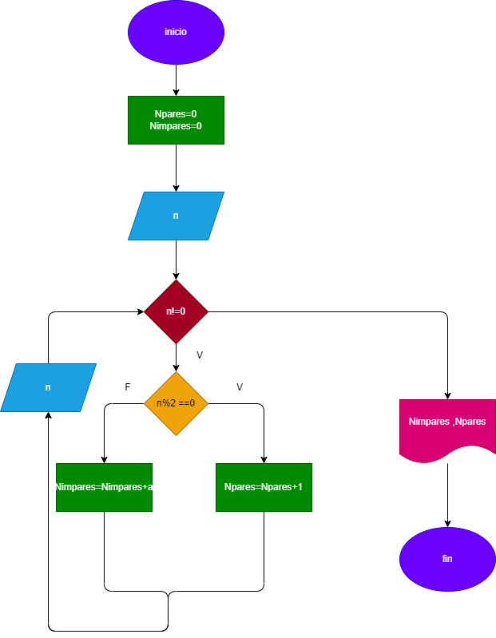

# contador-de-numeros-pares-e-impares

# hacer el diagrama de flujo y programa en phyen que lea numeros entereos y positivos(1 en cada lectura) y averigue cuantos son pares y cuantos son impares . Para terminal usaremo el rgistro centinela cuando el valor del numero leido sea cero  

# diseño

